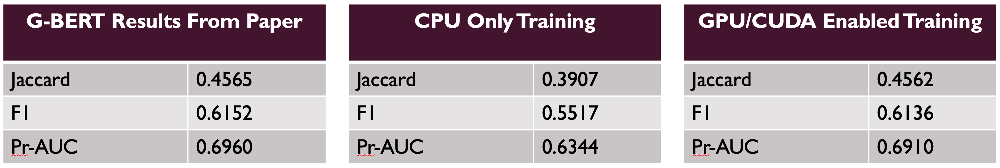

# G-Bert Reproduction
Reproduction of Pre-training of Graph Augmented Transformers for Medication Recommendation paper.

## Introduction

This project is to attempt to reproduce the results from the following paper:

```
@article{shang2019pre,
  title={Pre-training of Graph Augmented Transformers for Medication Recommendation},
  author={Shang, Junyuan and Ma, Tengfei and Xiao, Cao and Sun, Jimeng},
  journal={arXiv preprint arXiv:1906.00346},
  year={2019}
}
```

The original code repository can be found here: https://github.com/jshang123/G-Bert

## Instructions

### Requirements
 
Python >= 3.5 is required. The dependent python libraries are listed in the requirements.txt. To install them run:
```
pip install -r requirements.txt
```

### Data

This model is trained on the data from the MIMIC-III dataset which can be found at https://mimic.physionet.org/gettingstarted/dbsetup/. The method to preprocess the data is contained in EDA.ipynb which will process raw filed from the MIMIC-III dataset.

## Training

To train the model run:

```
chmod +x run_alternative.sh
./run_alternative.sh
```

This will do 15 iterations of 5 epochs of pre-training and 5 epochs of fine-tuning.

## Running the model

Navigate to the code/ directory.


To run the model run the following:
``` 
python run_gbert.py --model_name GBert-predict --use_pretrain --pretrain_dir /path/to/train/directory --graph
```

To run the pre-trained model in the repository run:
```
python run_gbert.py --model_name GBert-predict --use_pretrain --pretrain_dir ../saved/GBert-predict --graph
```

## Results of reproduction




